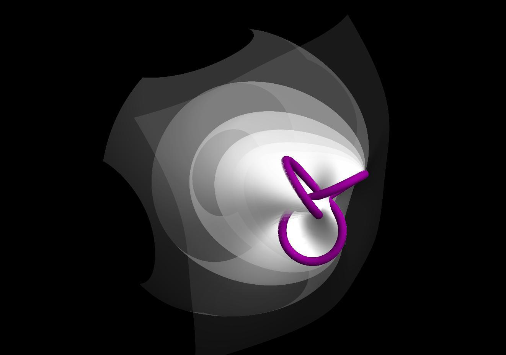

## What is a Milnor Fibration?

So now to the real meat of the topic. When you read the title of this article, you probably wondered what a [milnor fibration](https://en.wikipedia.org/wiki/Milnor_map) is. Perhaps you googled it and found that wikipedia page, or maybe even this [pdf](https://www.unf.edu/~ddreibel/research/milnor/milnor.pdf). Together they actually give a pretty good basis for defining the subject, which is more generally a milnor map, and here I hope to give you an intuitive understanding of how particular milnor maps are constructed, and how their resulting visualizations behave.

First, I think it is best to define the skeleton of the construction. For my purposes, I will be restricting my attention to mappings from $$\mathbb{S}^3 \rightarrow \mathbb{S}^1$$. The comprehensive mapping looks like this:

$$
M : \mathbb{S}^3 \setminus K \rightarrow \mathbb{S}^1.
$$

$$\mathbb{S}^3$$ conveniently lies in $$\mathbb{C}^2$$, so we can refer to $$(z,w) \in\mathbb{S}^3.$$ Additionally, this $$\mathbb{S}^3$$ will have radius $$\epsilon,$$ which we can worry about specifying later. A particular milnor map will rely on a complex polynomial

$$
f = z^m - w^n,
$$

where $$w,n \in \mathbb{N}_+.$$ We will see the effects of the choice of these variables are later. Now, we should define a special set $$V$$ and a relevant subset $$K$$,

$$
V = \left \{ (z,w) \in \mathbb{C}^2 \mid f(z,w) = 0_{\mathbb{C}} \right \};
$$

$$
K = V \cap \mathbb{S}^3
$$

$$V$$ is just $$f^{-1}(0_{\mathbb{C}})$$, and $$K$$ is the subset of $$V$$ that ends up in $$M$$'s domain, if it were not removed that is. Why is it removed? Let's look at how the Milnor map itself is defined:

$$
M: (z,w) \mapsto \frac{f}{\left| f \right|}.
$$

Ah, $$K$$ would cause problems as when $$f=0$$, $$M$$ is undefined. So where are the 'fibers' that were mentioned in the title? And, after all, where is the visualization opportunity? It seems that $$M$$ is working with a 4D input from $$\mathbb{S}^3$$, which by itself is beyond the reach of current printing technology.

Consider a point $$ \theta \in M^{-1} \subseteq \mathbb{S}^3 $$. The fibers that we want are in fact $$M^{-1}(\theta)$$. This preimage is in four dimensional $$\mathbb{S}^3$$, but we can use stereographic projection from $$\mathbb{S}^3 \rightarrow \mathbb{R}^3$$ to get a physical glimpse of it! Additionally, we can project $$K$$ into 3D along with the fibers. $$V$$ acts like a 'binding' for the fibered 'pages' that wrap around it. This kind of fibration is appropriately called an 'open book decomposition.'

My models are created using the following equations as basis (a summarization of the above process):

$$
M_{m,n} : \mathbb{S}^3 \setminus V \rightarrow \mathbb{S}^1 := M_{m,n}(z,w) \mapsto \frac{f}{\left | f \right |}
$$

$$
\sigma : \mathbb{S}^3 \rightarrow \mathbb{R}^3
$$

$$
\Phi : \mathbb{R}^2 \times \mathbb{S}^1 \rightarrow \mathbb{R}^3 := \Phi(m,n,\theta) \mapsto \sigma \circ M_{m,n}^{-1}(\theta)
$$

where $$\sigma$$ is the appropriate stereographic projection from a sphere of radius $$\epsilon$$, and $$M_{m,n}$$ denotes the specification of the polynomial $$f$$ used.

## Intuition

Visualizing various Milnor Fibrations involved many desicions about what in the visualization you want to emphasize. The basic sort of depiction involves would be just a single fiber. My notation for referencing a single fiber will be

$$
\Phi(m,n,\theta)
$$

where $$\theta$$ is the angle of projection and $$m,n$$ are the same as in $$M$$. This is the same as the mathematical definition above. For example, the model below is

$$\Phi(2,3,\pi/2)$$


Amazing! So what would $$\Phi(2,3,3\pi/4)$$ look like?

$$\Phi(2,3,3\pi/4)$$


Alright, there's definitely a pattern going on here, which is what we should expect from the nature of the domain of $$\Phi$$'s $$\theta$$. The consistent structure in the middle section of the model is the complex singularity that we've been interested in. You may have already guessed what happens at $$\theta = \pi$$,

$$\Phi(2,3,\pi)$$


As you can see, this fiber should stretch out to infinity, although I've cut it short for visual convenience. You might have to rotate and zoom this model a bit to get a good angle. As $$\theta$$ progresses along, the reflected fibers will wrap around to $$\Phi(3\pi/2)$$ which sits directly opposite to $$\Phi(\pi/2)$$, and then finally in $$3\pi/2 \leq \theta \leq 5\pi/2 = \pi/2$$ the fibers will blend through the inside of the structure and then back to the fiber we started at.

All of the above fibers have a boundry on the same knot in the middle area. In the case of $$\Phi(2,3,\pi/2)$$, it turns out in fact to be a 2-3 torus knot, the [trefoil knot](http://mathworld.wolfram.com/TrefoilKnot.html). Why is this? Looking back to our mathematical definitions, we see that the fibers are in the domain of $$M$$, which is $$\mathbb{S}^3 \setminus K$$. These points in $$K$$ are singular points of $$M$$, for they blow up and are not defined. So, what happens if we project $$K$$ alongside a fiber, say

$$\Phi(2,3,\pi/2)$$ 


There's $$K$$, right where we expected it, bordering the fiber. In this projection, I've actually blown up $$K$$ to be a tube, but the original set $$K$$ is simply a line following same path as the shown tube. If you take a close look at the feature image of this post, you can see the same tube of $$K$$ knotted in the center, and the expanding, fading 'pages' around it are various fibers. Pretty scenic! Below is an illustration with the same parameters of the feature image, but with just the white fiber and a slightly shifted viewing angle.

Now, how can we predict how this $$K$$ should look?

## Theory of $$\mathbb{S}^3 \setminus K$$

There is a detailed explanation of the topology of $$K$$ in Milnor's own work [Singular points of complex hypersurfaces](http://www.jstor.org/stable/j.ctt1bd6kvv), however I will only cover it briefly here.

Lets start in 4-space, the domain of $$M$$. Milnor's Lemma 5.9 states that there exists a smooth vector field $$\textbf{v}$$ on $$\mathbb{D}^3 \setminus V$$ such that the inner product

$$
\langle \textbf{v}(z), \textnormal{grad } \log f(z) \rangle
$$

is real and positive for all $$z$$ and that $$\langle \textbf{v}(z),z \rangle$$ has a positive real part. Next, consider the solutions to the differential equation

$$
\frac{dp}{dt} = \textbf{v}(p(t))
$$

on the same $$\mathbb{D}^3 \setminus V$$. Following from 5.9, we can deduce that $$\vert f(p(t)) \vert $$ is strictly monotone. With the condition $$2\mathscr{R}\langle \frac{dp}{dt},p(t) \rangle = \frac{d\|p(t)\|^2}{dt} > 0$$, we have a guarantee that $$\|p(t)\|$$ is strictly monotone.

From this, we can think about starting at a point $$z \in \mathbb{D}^3 \setminus V$$ and follow the appropriate path along $$\textbf{v}$$ away from the origin (this direction will increase $$\vert f(z) \vert$$) until we must get to a point on the circle, $$z^\prime \in \mathbb{S}^3 \setminus V$$, for which

$$
\frac{f(z^\prime)}{\vert f(z^\prime) \vert} = \frac{f(z)}{\vert f(z) \vert}.
$$

Finally we have Milnor's lemma 5.10: Let $$c$$ be a small complex constant and $$e^{i\theta} = \frac{c}{\vert c \vert}$$. The intersection of the hyperplane $$f^{-1}(c)$$ with an open $$\mathbb{D}^3_{\epsilon}$$ is diffeomorphic to the portion of $$\Phi(\theta)$$ defined by $$\vert f(z) \vert > \vert c \vert$$.

Additionally, if we pick a small enough $$\epsilon$$, then the concerned portion of $$\Phi(\theta)$$ is actually diffeomorphic to all of $$\Phi(\theta)$$! This cements the intuition that $$\Phi(\theta)$$ is basically sweeping around the boundary $$f^{-1}(0) = K$$, yielding our visuals of fibers all bounded by the same curve.

This work also introduces us to another variable, $$\epsilon$$. In the lemmas, Milnor uses $$\epsilon$$ as the sizes of his disks. In my work, I've made analogous use of $$\epsilon$$ as the radius of the $$\mathbb{S}^3$$ that houses the fibers and provides the domain for stereographic projection. The particular $$\epsilon$$ that I've been using is $$2$$, which was originally felt out by [Dan Dreibel](https://www.unf.edu/~ddreibel/research/milnor/milnor.html) in his work at University of North Florida.

## Behavior of $$K$$

When I first started working on this project, my approach was to get a program working to produce visuals, and then to explore for some intuitive patterns in addition to reading about the theory. Now that I've bombared you with some theory, I'm going to (hopefully) provide you a handhold of intuition so that the theory and the visuals make mores sense together.

So, here's a table of some fibers with $$K$$ imbedded on them, in __an__ order. See if you can find some patterns:

$$\Phi(1,1,\pi/2)$$

$$\Phi(1,2,\pi/2)$$

$$\Phi(1,3,\pi/2)$$


It turns out that $$m$$ corresponds to how many times $$K$$ around the one orientation of the model, and $$n$$ corresponds to how many times $$K$$ wraps around a perpendicular orientation. Look back to the model I presented of $$\Phi(2,3,0)$$ and verify for yourself this pattern.

Now, what do you think $$\Phi(2,2,\pi/2)$$ looks like? Make a guess and then check below.

$$\Phi(2,2,\pi/2)$$


Interesting! These parameters resulted in an edge that consists of two seperate paths. This composition of them is referred to as a [link](http://mathworld.wolfram.com/Link.html), this particular one being the [Hopf link](http://mathworld.wolfram.com/HopfLink.html). This fibration is also fun because if you draw the opposite fiber you see that $$K$$ lies neatly on a 3D torus

$$\Phi(2,2,3\pi/2) \cup \Phi(2,2,\pi/2)$$


## Some more theory on $$K$$

So far, we've seen a few different varieties of edges. For example, $$\Phi(1,1)$$'s edge was an unknot (simply a circle), $$\Phi(2,2)$$'s edge was a Hopf link, and $$\Phi(2,3)$$'s edge was a trefoil knot. The total explanation of $$(m,n)$$'s correspondence to the type of $$K$$ produced is the following:

$$
K = \left \{ (z,w) \in \mathbb{S}^1 \textnormal{ such that } \vert z \vert e^{n i \theta} - \vert w \vert e^{m i \theta + \pi i / m} = 0  \right \}
$$

This is essencially a restating of the definition of $$K$$ from long before, but this time we get a look at the internal workings. Following the intuition of wrapping so many times in specific directions, this deconstruction of $$K$$ reveals that this is the result of coprime $$m,n$$ yeilding a $$(m,n)$$ torus knot of $$K$$! You can check this for youself (or read Milnor). Lets take a look at a few torus knot examples (besides the exhaustively used 2,3):

$$\Phi(3,4,\pi/2)$$

$$\Phi(3,5,\pi/2)$$


All of these knots are torus knots, and the further truth is that all torus knots are expressable in this way! A corralary, all torus knots are fibered.

Milnor additionally explores that $$m,n$$ of the form $$m = mp$$ where $$p$$ is prime results in $$p$$ a $$K$$ that has $$p$$ non-singular branches, each with a link number $$n$$. This is supported by our observations with $$\Phi(2,2,\pi/2)$$, which follows with $$p=1$$. And, indeed, the resulting link has $$2=m$$ branches, each with link number $$1=p$$! Great! Here are two other fun examples (the fibers get in the way so are not displayed):

$$\Phi(3,6,\pi/2)$$

$$\Phi(2,8,\pi/2)$$


## Conclusion

I hope that you've enjoyed diving into the visualization of Milnor fibrations with me, and that you've learned a bit of interesting theory as well. If you are especially interested in knots, links, and the like I highly recommend [Knots and Links](https://books.google.com/books/about/Knots_and_Links.html?id=qFLvAAAAMAAJ). The section on "Fibered Knots" was especially helpful in developing a framework in which to better understand Milnor fibrations.

I included many visuals in this article, though they all happen to just be computer generated models. As part of Project Project, my goal was not just to create computer models, but tangible physical models as well. In my next article, [Fibration Fabrication]({{ site.baseurl }}/posts/milnor-fibrations-models), I will explain my methods and results. Be prepared for some coding as well!
