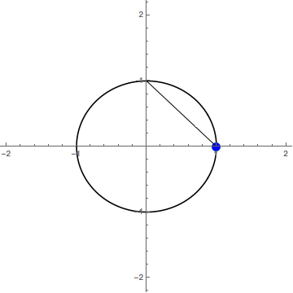

## Introduction

Stereographic projection, in short, is a technique for preserving the structure of a set on $$\mathbb{S}^n$$ in a $$n$$-dimensional representation.Doing this can be extremely useful when, for example, you have some 4D surface on $$\mathbb{S}^3$$, but you want to be able to actually see it. This comes up in my work with [Milnor Fibrations]({{ site.baseurl }}/posts/milnor-fibrations), where the fibers do in fact live on $$\mathbb{S}^3$$. This article will explain how stereographic projection works in general, and at the end there are some neat, interactive examples.

How does this sort of projection preserve what kind of structure, and how does it work exactly? Read more to find out.

## Stereographic Projection

First of all I want to make notation clear, for the notation of an $$n$$-sphere ($$\mathbb{S}^n$$) is a little counterintuitive. A $$n$$-sphere is a sphere in $$n-1$$ dimensions: A 1-sphere is a circle (2-dimensional), a 2-sphere is 3-dimensional, a 3-sphere is 4-dimensional, etc. Additionally, $$n$$-spheres contain only the points that are the sphere's radius away from the sphere's center, and no points in between. This contrasts $$\mathbb{S}^n$$ from a closed $$n$$-disk ($$\mathbb{D}^n$$), which contains all the points on and within the $$\mathbb{S}^n$$. Now on to projection!

Lets try projecting $$\mathbb{S}^1 \rightarrow \mathbb{R}^1$$, so $$n=1.$$. It is possible to modify the location and size of $$\mathbb{S}^n,$$ but let's not worry about that right now. To project a point $$p$$, from this circle down onto $$\mathbb{R}^1$$, draw a line from the top of the circle, a point we will call $$\infty$$, through $$p$$ making sure to extend your line so that it passes through $$\mathbb{R}^1$$. The point at which this line intersects $$\mathbb{R}^1$$ is $$p^\prime.$$

In the gif below, the green dot is $$p$$ and the blue dot is $$p^\prime.$$

It is hard to tell, but the frame where the green dot would be at the top of the circle is missing (intentionally). It turns out that our name for that point was appropriate; it would map to $$\pm \infty$$ on $$\mathbb{R}^1.$$ This doesn't make sense for the projection though, so one way to solve this is just to remove $$\infty$$ from the domain, via the final mapping

$$
\mathbb{S}^n \setminus \infty \rightarrow \mathbb{R}^n
$$

This 2D to 1D example probably seems boring, but it clearly shows the process. If you are interested in the aesthetics of 3D to 2D stereographic projection, I recommend you check out Henry Segerman's models that use a light source at [latex]\infty[/latex] to project a cutout [latex]\mathbb{S}^n[/latex] onto the ground: [(7,3,2) triangles](https://www.thingiverse.com/thing:1608550), [(5,3,2) triangles](https://www.thingiverse.com/thing:1608531), [(7,3,2) triangles (small)](https://www.thingiverse.com/thing:477006).

## Interactive Examples

The 3D model below demonstrates a circle on $$\mathbb{S}^2$$ being mapped to $$\mathbb{R}^2$$ via stereographic projection (created by Kyle Ormsby). Note that the circle is preserved!



For some more interactive examples, I've created a Mathematica notebook that demonstrates stereographic projection into $$\mathbb{R}^3, \mathbb{R}^2$$ and, of course, $$\mathbb{R}^1.$$ Check it out here: [stereographic projection](../assets/posts/stereographic-projection/stereographic-projection.nb)

## Application - Milnor Fibrations

Now that you've learned about the process of stereographically projecting, I reccomend that you check out my article about [Milnor Fibrations]({{ site.baseurl }}/posts/milnor-fibrations), a mesmerizing application of this straightforward process of projecting from the dimensions above!
